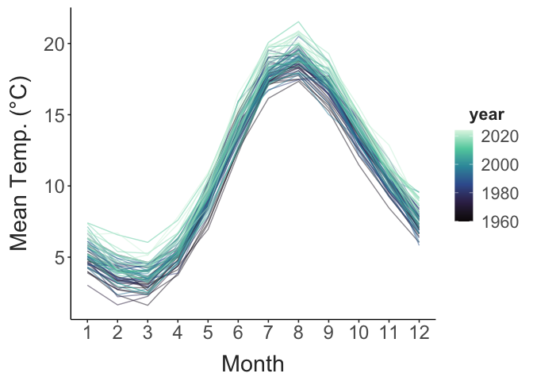
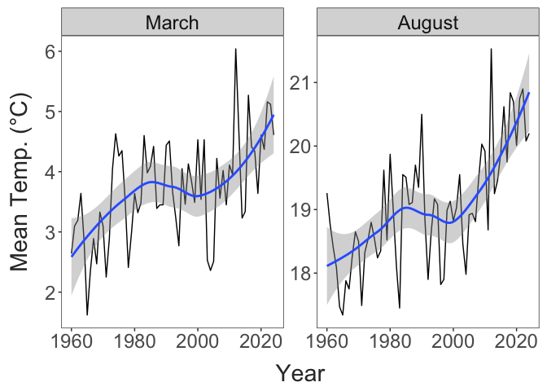
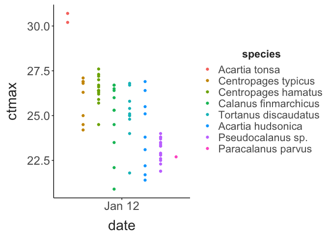
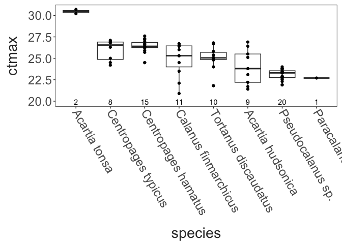
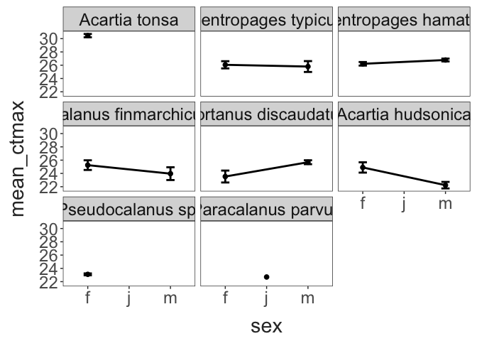
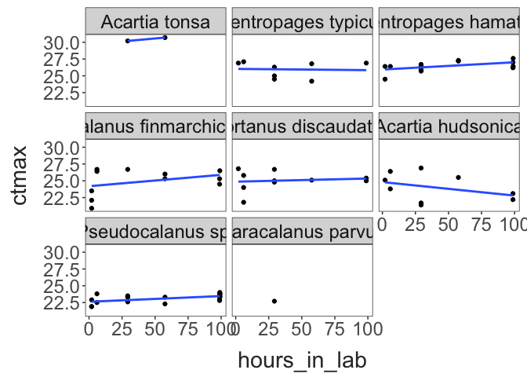
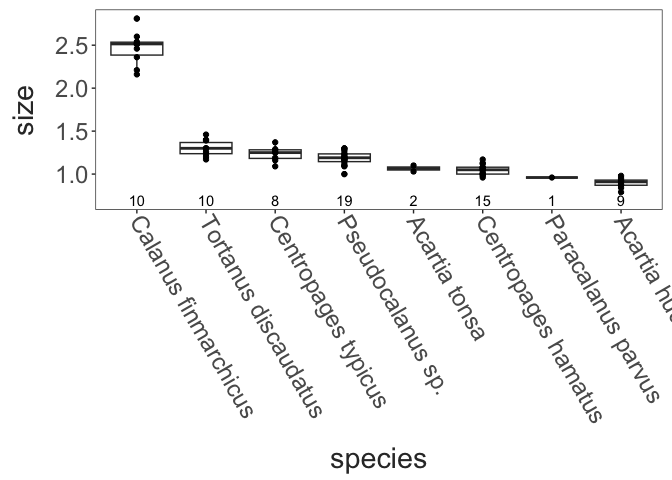
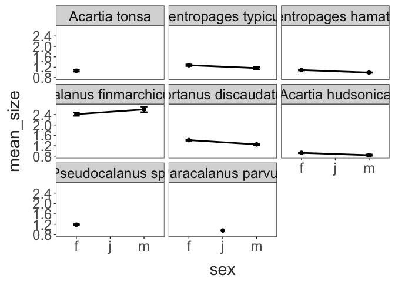
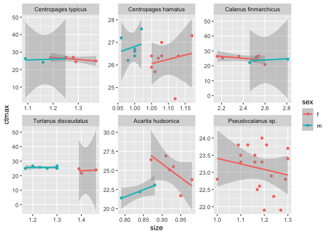
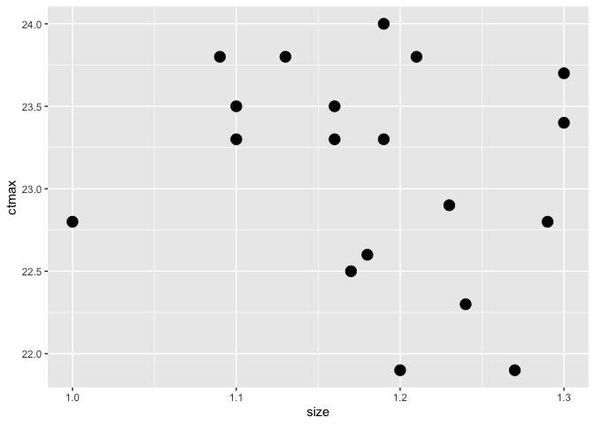

SCoPE: Seasonality in Copepod Physiology and Ecology
================
2026-02-07

- [Boston Harbor Seasonality](#boston-harbor-seasonality)
- [CTmax Data](#ctmax-data)

## Boston Harbor Seasonality

``` r
bharb_temps %>% 
  mutate(month = lubridate::month(date),
         year = lubridate::year(date)) %>% 
  ggplot(aes(x = month, y = mean_temp, group = year, colour = year)) + 
  geom_line(alpha = 0.5) + 
  scale_x_continuous(breaks = c(1:12)) + 
  scale_colour_viridis_c(option = "G") + 
  labs(x = "Month", 
       y = "Mean Temp. (°C)") + 
  theme_matt() + 
  theme(legend.position = "right")
```



``` r
bharb_temps %>% 
  mutate(month = lubridate::month(date),
         year = lubridate::year(date)) %>% 
  filter(month %in% c(3, 8)) %>% 
  mutate(month = if_else(month == 3, "March", "August"),
         month = fct_relevel(month, "March", "August")) %>% 
  ggplot(aes(x = year, y = mean_temp)) + 
  facet_wrap(.~month, scales = "free_y") + 
  geom_line() + 
  geom_smooth() + 
  labs(x = "Year", 
       y = "Mean Temp. (°C)") + 
  theme_matt_facets()
```



## CTmax Data

``` r

trait_data %>% 
  mutate(date = as_date(collection_datetime)) %>% 
  ggplot(aes(x = date, y = ctmax, colour = species)) + 
  geom_point(position = position_dodge(width = 0.1)) + 
  theme_matt() + 
  theme(legend.position = "right")
```



``` r

sample_sizes = trait_data %>% 
  count(species)

trait_data %>% 
ggplot(aes(x = species, y = ctmax)) + 
  geom_boxplot() + 
  geom_point() + 
  geom_text(data = sample_sizes, aes(y = min(trait_data$ctmax) - 1, label = n)) + 
  theme_matt_facets() + 
  theme(axis.text.x = element_text(angle = 300, hjust = 0, vjust = 0.5))
```



``` r

trait_data %>% 
  group_by(species, sex) %>% 
  summarise(mean_ctmax = mean(ctmax, na.rm = T), 
            ctmax_se = sd(ctmax) / sqrt(n())) %>% 
ggplot(aes(x = sex, y = mean_ctmax, group = species)) + 
  facet_wrap(species~.) + 
  geom_line(linewidth = 1) + 
  geom_errorbar(aes(ymin = mean_ctmax - ctmax_se, ymax = mean_ctmax + ctmax_se),
                width = 0.2, linewidth = 1) + 
  geom_point(size = 2) + 
  theme_matt_facets()
```



``` r
trait_data %>% 
  ggplot(aes(x = hours_in_lab, y = ctmax, group = collection_datetime)) + 
  facet_wrap(species~.) + 
  geom_point() + 
  geom_smooth(method = "lm",
              se = F) + 
  theme_matt_facets()
```



``` r

size_sample_sizes = trait_data %>% 
  drop_na(size) %>% 
  count(species)

trait_data %>% 
  drop_na(size) %>% 
  mutate(species = fct_reorder(species, size, median, .desc = T)) %>% 
ggplot(aes(x = species, y = size)) + 
  geom_boxplot() + 
  geom_point() + 
  geom_text(data = size_sample_sizes, aes(y = min(trait_data$size, na.rm = T) - 0.1, label = n)) + 
  theme_matt_facets() + 
  theme(axis.text.x = element_text(angle = 300, hjust = 0, vjust = 0.5))
```



``` r
trait_data %>% 
  group_by(species, sex) %>% 
  summarise(mean_size = mean(size, na.rm = T), 
            size_se = sd(size, na.rm = T) / sqrt(n())) %>% 
ggplot(aes(x = sex, y = mean_size, group = species)) + 
  facet_wrap(species~.) + 
  geom_line(linewidth = 1) + 
  geom_errorbar(aes(ymin = mean_size - size_se, ymax = mean_size + size_se),
                width = 0.2, linewidth = 1) + 
  geom_point(size = 2) + 
  theme_matt_facets()
```



``` r

high_abund = trait_data %>% 
  count(species, sex) %>% 
  filter(n > 3)

trait_data %>% 
  filter(sex != "j", species %in% unique(high_abund$species)) %>% 
ggplot(aes(x = size, y = ctmax, colour = sex)) + 
  facet_wrap(species~., scales = "free") + 
  geom_point() + 
  geom_smooth(method = "lm")
```



``` r

pseudocal = trait_data %>% 
  filter(species == "Pseudocalanus sp.")

ggplot(pseudocal, aes(x = size, y = ctmax)) + 
  geom_point(size = 4)
```


